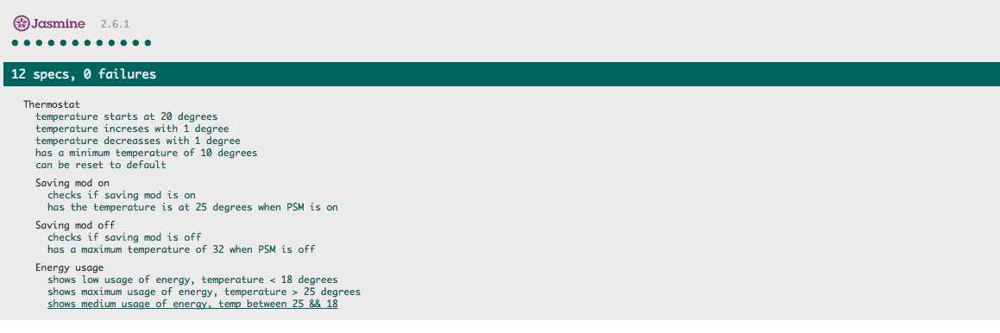
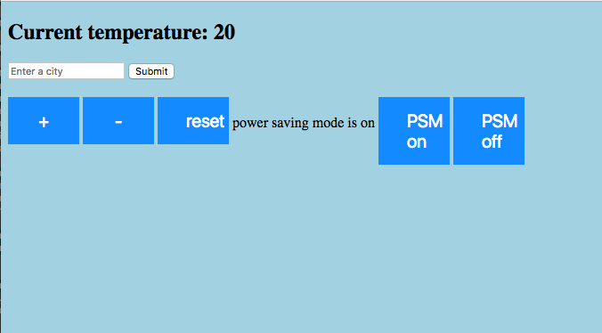

## Thetmostat

* Displays the temperature from a certain city in the world

- The app is build using javascript and has a nice interface which I made it  using jQuery library
- Code is tested using Jasmine testing library

### Test coverage

- UI

